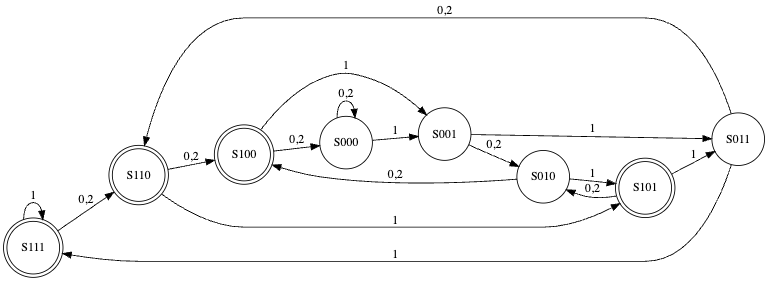

# Project: Finite State Automata

This project implements a finite state automata in Rust. The state automata accepts a sequence of digits and transitions between states based on the current state and the input digit. The final state of the automata is determined by the sequence of digits.

## Code Overview

The main component of the project is the `StateAutomata` struct, which represents the state automata. It has a single field, `state`, which stores the current state of the automata.

```rust
#[derive(Debug, Default, PartialEq)]
pub struct StateAutomata {
    pub state: u8
}
```

The `StateAutomata` struct has several methods:

- `next(&mut self, digit: u8)`: This method updates the state of the automata based on the input digit.
- `is_final(&self) -> bool`: This method checks if the current state is a final state.
- `process_input(input: Vec<u8>) -> bool`: This static method processes a sequence of digits and returns whether the final state is a final state.

The state transitions are defined in the comments of the `StateAutomata` struct:




The `main` function creates a `StateAutomata`, processes a sequence of digits, and prints a message when a final state is reached.

```rust
fn main() {
    let mut state_automata = StateAutomata::default();
    let input = vec![1, 1, 0, 1, 2, 0, 1, 2, 0, 1, 2, 1, 0, 2];
    for digit in input {
        state_automata.next(digit);
        if state_automata.is_final() {
            println!("Final state reached");
            break;
        }
    }
}
```

The project also includes a test module, which verifies that the state automata correctly identifies sequences where the digit 1 is third from the last.

```rust
#[cfg(test)]
mod tests {
    use super::*;

    #[test]
    fn accepts_only_words_where_1_is_3rd_from_last() {
        assert_eq!(StateAutomata::process_input(vec![1, 1, 0, 1, 2, 0, 1, 2, 0, 1, 2, 1, 0, 2]), true);
        assert_eq!(StateAutomata::process_input(vec![1, 1, 0, 1, 2, 0, 1, 2, 0, 1, 2, 2, 0, 2]), false);
        assert_eq!(StateAutomata::process_input(vec![1, 1, 0, 1, 2, 0, 1, 2, 0, 1, 2, 0, 0, 2]), false);
        assert_eq!(StateAutomata::process_input(vec![1, 1, 0, 1, 2, 0, 1, 2, 0, 0, 0, 0, 0, 0]), false);
        assert_eq!(StateAutomata::process_input(vec![0]), false);
        assert_eq!(StateAutomata::process_input(vec![1]), false);
        assert_eq!(StateAutomata::process_input(vec![2]), false);
    }
}
```

## Running the Code

To run the code, ensure that Rust is installed and up to date:

```bash
rustup override set stable && rustup update
```

Then, run the tests:

```bash
cargo test
```

Finally, run the main function:

```bash
cargo run
```

## Summary

This project provides a simple and efficient implementation of a finite state automata in Rust. It demonstrates how to define and manipulate states, how to define state transitions, and how to check if a sequence of digits leads to a final state. The code is well-documented and includes tests to verify its correctness.